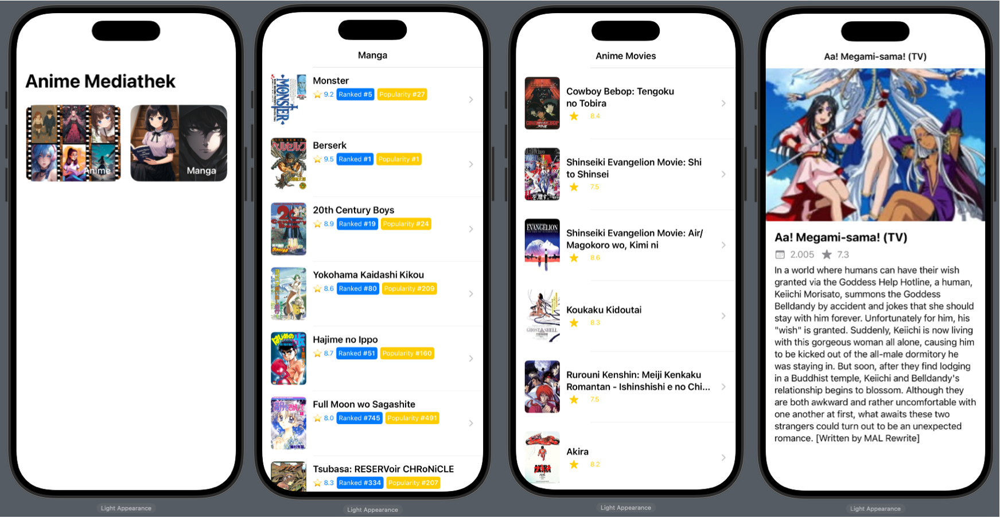
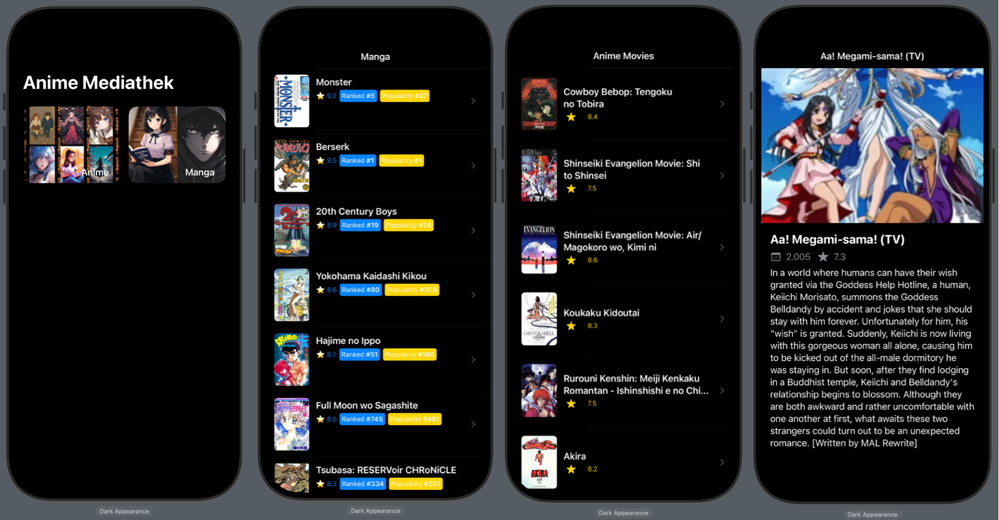
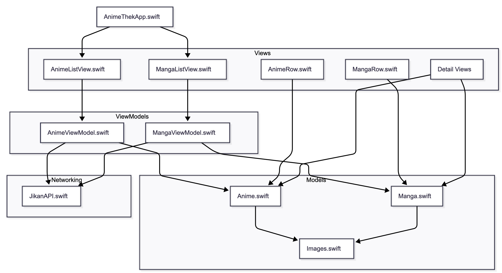
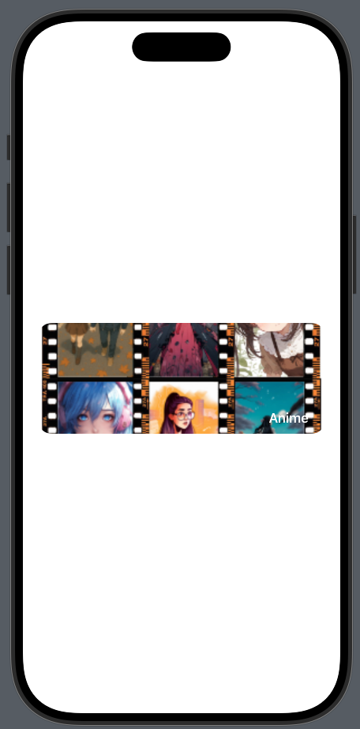

# 🎬 AnimeThek

### A SwiftUI App for Exploring Anime & Manga Data (Jikan API)

AnimeThek is a modern **SwiftUI** application that demonstrates clean architecture, modular networking, structured async/await flows, reusable UI components, and scalable view models.  
It fetches data from the **[Jikan API](https://jikan.moe/)** and displays anime information in a clean, responsive interface.

This project is designed as a **sample code showcase** for iOS practices.  
It focuses on clarity, maintainability, testing readiness, and SwiftUI-first design.

## Why This Project Matters

AnimeThek showcases modern iOS engineering practices using SwiftUI, async/await, MVVM, and a modular architecture.  
It demonstrates how to build scalable apps with clean state management, testable layers, and reusable UI components.

## Screenshots

<p float="left">
  
  
</p>

## Features

- 📱 Built with **SwiftUI** end-to-end
- 🔗 Async/Await networking layer
- 📦 Decoupled modular architecture (Services, Models, ViewModels, UI)
- ♻️ Reusable UI components (Cards, Lists, Loaders)
- 🔍 Anime search with debouncing
- 🎨 Light & Dark Mode support
- 📐 Clean MVVM structure
- 💥 Error handling with user-friendly messaging
- 🔧 Ready for unit testing and dependency injection

## Architecture

AnimeThek follows a **clean, layered MVVM architecture**:



```sh
AnimeThek/
├── Models/
├── Networking/
│ ├── APIClient.swift
│ ├── Endpoint.swift
│ └── Requests/
├── Services/
│ ├── AnimeService.swift
│ └── Protocols/
├── ViewModels/
├── Views/
│ ├── Screens/
│ └── Components/
├── Utils/
└── Resources/
```

### Architectural principles:

- **Decoupling** between networking and UI
- **Dependency injection** for testability
- **Async/await** for clean readability
- **One-way data flow** with `@StateObject` and `@Published`
- **Preview-driven development**

---

## 🛠 Tech Stack

- Swift 5.9+
- SwiftUI
- MVVM
- async/await
- SPM
- Jikan API

---

## 🌐 Networking Layer

AnimeThek includes a lightweight reusable networking abstraction:

- `APIClient` handles all async requests
- `Endpoint` provides type-safe API construction
- `AnimeService` exposes high-level domain functions
- Swift's `Decodable` is used for safe JSON parsing

### State Management (MVVM)

Each screen has:

- a ViewModel responsible for logic, networking, transforms
- a SwiftUI View focused on rendering
- async/await tasks triggered safely from the UI
- observable state via @Published

Example (simplified):

```swift
@MainActor
class AnimeSearchViewModel: ObservableObject {
    @Published var query = ""
    @Published var results: [Anime] = []
    @Published var isLoading = false

    private let service: AnimeServiceProtocol

    init(service: AnimeServiceProtocol = AnimeService()) {
        self.service = service
    }

    func search() async {
        guard !query.isEmpty else { return }
        isLoading = true

        do {
            results = try await service.searchAnime(query)
        } catch {
            results = []
        }

        isLoading = false
    }
}
```

## UI Components

AnimeThek includes reusable components such as:

- CardCategory
- AsyncImage loader wrapper
- SearchBar
- ErrorStateView
- Loading indicator
- Designed for scalability and reusability across screens.

<br>

## 🧩 SwiftUI Component Preview

AnimeThek uses SwiftUI previews to render UI components in isolation, supporting fast iteration and design-system thinking.

Here is an example preview for one of the reusable components:

```swift
#Preview(traits: .sizeThatFitsLayout) {
    CategoryCard(category: .anime)
        .padding(20)
}
```

### Preview

<p float="left">
  
</p>

## Testing (Ready)

The architecture is designed for easy testing:

- Services conform to protocols
- ViewModels are independent of SwiftUI
- Networking layer supports mock injection

Example test-ready structure:

```swift
final class MockAnimeService: AnimeServiceProtocol {
    func searchAnime(_ query: String) async throws -> [Anime] {
        return [.mock]
    }
}
```

## License

This project is licensed under the MIT License.

## 🛠 Requirements

- iOS 17+
- Xcode 15+
- Swift 5.9+

## Installation

Clone the repository:

```sh
    git clone https://github.com/NJRojas/animethek.git
```

Open the project

```sh
    open AnimeThek.xcodeproj
```

Build & run in Xcode.

## 👩‍💻 Author

Neyla Rojas
Senior iOS Engineer (Swift · SwiftUI · Architecture)
